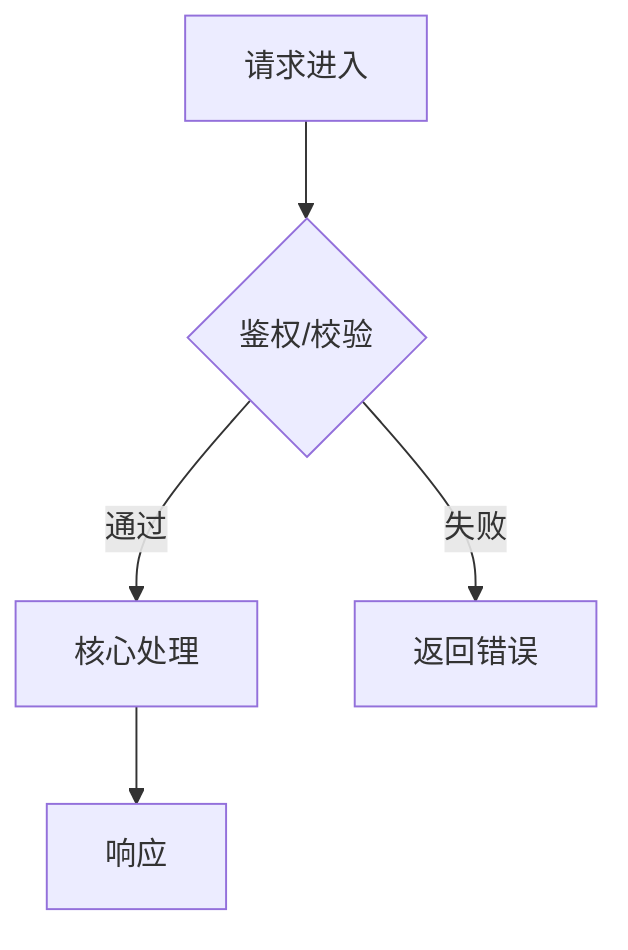

# 文档模板（YYYY-MM-DD-主题名.md）

> 创建日期：2025-12-26  
> 最近修订：2025-12-26

## 生成规范（必读）
> 说明：本模板用于 AI/人类协同编写，生成时必须遵守以下规则。
- 必填章节：文档元信息、修订日志、文件命名、背景、目标、变更类型、范围、设计要点、实现路径、配置/注解/参数、可观测性、兼容性清单、风险与回归、发布与回滚、验证
- 可选章节：流程图（按需）、接口说明（如涉及）、行为说明（如涉及）、示例（如涉及）、术语与缩写（如涉及）、后续
- 空值处理：无内容时填 `- 无`，禁止留空，禁止 `.../TBD/placeholder`
- 占位符替换：`<name>`、`placeholder` 等必须替换为真实值
- 日期规则：创建日期=文件名日期；最近修订=最后修改日期；修订日志每次修改新增一行
- 语言与风格：用简洁陈述句；每条一行；避免“可能/大概/酌情”等模糊词；不承诺未实现功能
- 事实边界：信息未知必须写明“不确定/待确认”并标注原因
- 范围控制：只描述本次变更内容，超出范围写在“后续”
- 命名约束：仅约束新文档；历史文档可保留旧命名

## 文档元信息（必填）
> 要求：用于追溯与发布管控。
- 状态：draft/reviewed/approved
- 关联 PR/Commit：

## 修订日志
| 日期 | 版本 | 作者 | 变更说明 |
| --- | --- | --- | --- |
| 2025-12-26 | v1.0 | <name> | 初稿 |

## 文件命名
- 固定格式：`YYYY-MM-DD-主题名.md`
- 示例：`2025-12-26-delete-nodegroup-node.md`

## 背景
> 要求：至少 2 条（现状问题、影响范围），约束/前置必须说明。
- 现状问题：
- 影响范围：
- 约束/前置：

## 目标
> 要求：至少 2 条（达成效果、不做什么）。
- 达成效果：
- 不做什么（明确排除）：

## 变更类型
> 要求：至少 1 条；可多选。
- 修复（bugfix）：
- 功能（feature）：
- 重构（refactor）：
- 运维/配置（ops/config）：

## 范围（必须明确）
> 要求：避免范围膨胀，明确变更边界。
- 变更范围：
- 不变更内容：

## 术语与缩写（如涉及）
> 说明：出现缩写/内部术语必须列出；否则写 `- 无`。
- 术语/缩写：
- 含义：

## 设计要点
> 要求：至少 2 条（核心思路/数据流、兼容性/用户态保证）。
- 核心思路/数据流：
- 关键假设：
- 兼容性/用户态保证：

## 实现路径
> 要求：给出具体文件路径与关键函数/对象名；说明复用点。
- 代码位置：
- 关键依赖/复用点：

## 配置/注解/参数
> 要求：新增/变更配置必须写；无则写 `- 无`。
- 新增/变更项：
- 默认值与变更方式（热/冷）：
- 影响面：

| 名称 | 类型 | 默认值 | 变更方式 | 影响面 | 备注 |
| --- | --- | --- | --- | --- | --- |
| <name> | <type> | <default> | <hot/cold> | <scope> | <note> |

## 流程图（按需）
> 说明：当存在 >=2 个分支/状态迁移或数据流不直观时必须添加；否则写 `- 无（原因）` 并删除示例图。
- 无（原因）：


## 接口说明（如涉及）
> 说明：新增/变更对外 API 必填；纯内部逻辑可写 `- 无（原因）` 并删除子节。
### 路由/调用
- 方法 + 路径：
- Header/鉴权：
- Query/Path 参数：
- 幂等/重试/超时：

### 请求体
> 要求：必须替换示例占位符；字段变更需说明含义/默认值。
```json
{ "placeholder": "..." }
```

### 响应体（概要）
> 要求：必须替换示例占位符；给出关键字段含义。
```json
{ "result": "...", "errors": [] }
```

### 字段要点
- listMeta.totalItems：
- 可过滤/排序字段：
- 枚举返回：

### 错误与边界
> 要求：至少列出 2 种典型错误及处理策略。
- 典型错误：
- 非致命错误处理策略：

## 行为说明（语义/降级/回退）
> 说明：涉及降级/回退/缓存/幂等/重试/失败策略必须写；否则 `- 无`。
- 例：优先 SSA，失败降级 Create/Update
- 例：失败缓存 TTL 缩短，成功保持默认 TTL

## 可观测性
> 要求：新增/变更日志/指标/告警必须写；无则 `- 无`。
- 日志：
- 指标：
- 告警/看板：

## 兼容性清单
> 要求：显式说明兼容性结论与影响面。
- CRD/Schema 兼容性：
- API 兼容性：
- 数据/注解兼容性：
- 存量集群/升级路径：

## 示例（curl/SDK）
> 说明：对外 API 必须给 curl 示例；内部逻辑可写 `- 无（原因）` 并删除示例块。
```bash
# 示例 1
curl ...
```

## 风险与回归
> 要求：至少 1 个可能破坏点 + 1 个回归触发条件，尽量量化影响面。
- 可能破坏点：
- 回归触发条件：

## 发布与回滚
> 要求：说明灰度策略、回滚条件与步骤；无则写 `- 无` 并说明原因。
- 灰度/发布策略：
- 回滚条件：
- 回滚步骤：

## 验证
> 要求：至少 1 条本地/单测命令；若无法执行，写明原因与替代验证。
- 本地/单测命令：
- 线上验证步骤：

### 验证矩阵（建议）
| 类型 | 覆盖点 | 命令/步骤 | 结果 |
| --- | --- | --- | --- |
| 单测 | | | |
| 集成 | | | |
| 冒烟 | | | |
| 线上观察 | | | |

## 后续
> 说明：仅写本次变更明确不做但未来可能做的事项；无则 `- 无`。
- 可配置项/优化项：
- 未决问题：
